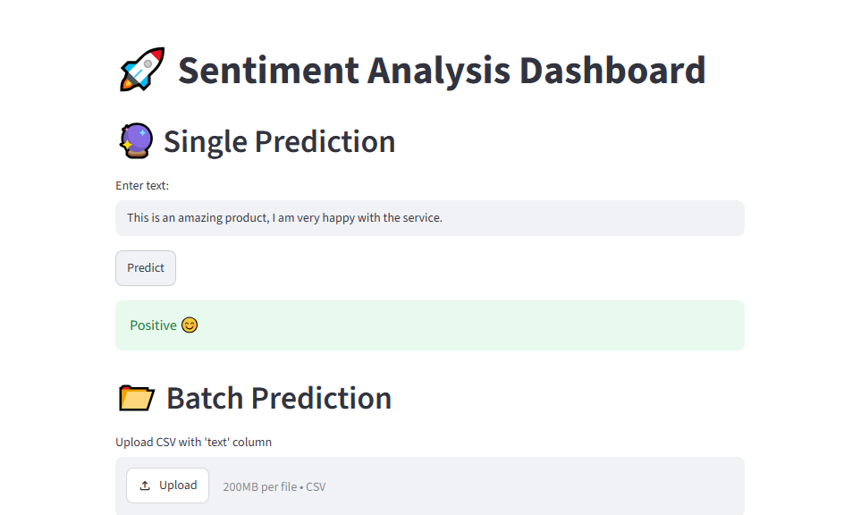
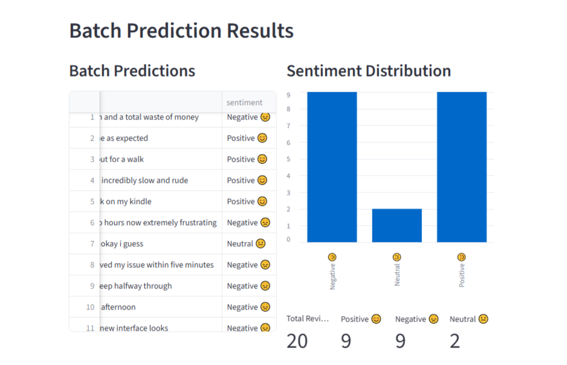
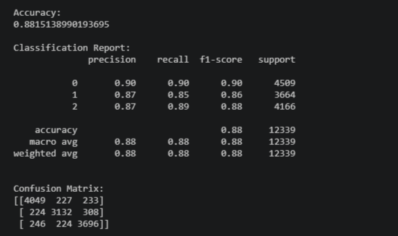
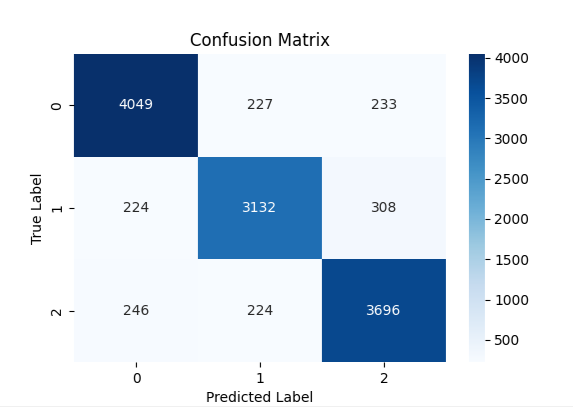

# 🚀 Sentiment Analysis Dashboard

A Machine Learning web application built with Streamlit for sentiment classification and batch text analytics.

---

## 📌 Project Overview

This project uses Natural Language Processing (NLP) and Machine Learning to classify text into:

- Positive 😊  
- Neutral 😐  
- Negative 😞  

The application supports both single-text prediction and batch prediction through CSV file uploads.

The training pipeline (`train.py`) is separated from the user interface (`app.py`) to enable faster application startup and efficient deployment.

---

## 📊 Dataset

The model is trained on a Twitter Sentiment dataset consisting of labeled text samples classified into:

- Positive  
- Neutral  
- Negative  

This dataset is used for supervised learning of sentiment patterns in text.

---

## 🎯 Use Cases

This project can be used for:

- Customer review analysis  
- Product feedback monitoring  
- Company review analysis  
- Social media sentiment tracking  
- Brand reputation monitoring  
- Survey response analysis  
- Public opinion analysis  
- Market research  

---

## ✨ Features

- Single text sentiment prediction  
- Batch CSV sentiment prediction  
- Sentiment distribution visualization  
- Interactive metrics dashboard  
- TF-IDF feature extraction  
- Linear SVC classifier  
- Serialized model loading using Joblib  
- Streamlit web interface  

---

## 📸 Application Preview

### Single Prediction



---

### Batch Prediction



---

## 📊 Model Performance

### Model Accuracy

**88.15%**

The model uses a TF-IDF Vectorizer combined with a Linear Support Vector Machine (LinearSVC) classifier for multi-class sentiment prediction.

---

### Classification Report

| Class    | Precision | Recall | F1-Score |
|----------|----------|--------|----------|
| Negative | 0.90     | 0.90   | 0.90     |
| Neutral  | 0.87     | 0.85   | 0.86     |
| Positive | 0.87     | 0.89   | 0.88     |

---

### Classification Report Screenshot



---

### Confusion Matrix



---

## 🧠 Machine Learning Workflow

- Data Cleaning  
- Text Preprocessing  
- TF-IDF Vectorization  
- Model Training using Linear SVC  
- Model Serialization using Joblib  
- Real-time Prediction through Streamlit  

---

## 🗂️ Project Structure

```text
sentiment-analysis-project/
│
├── data/
│   └── twitter_training.csv
│
├── screenshots/
│   ├── single_prediction.png
│   ├── batch_prediction.png
│   ├── confusion_matrix.png
│   └── classification_report.png
│
├── train.py
├── app.py
├── model.pkl
├── vectorizer.pkl
├── requirements.txt
├── README.md
├── .gitignore
└── venv/
```
---

## 🛠️ Technologies Used

- Python  
- Pandas  
- Scikit-learn  
- Streamlit  
- Joblib  
- Matplotlib  
- Seaborn  

---

## ⚙️ Installation

### Create a virtual environment:

```bash
python -m venv venv
```
## Activate the environment
**Windows**
```bash
venv\Scripts\activate
```
**Linux / Mac**
```bash
source venv/bin/activate
```
## 📦 Install dependencies
```bash
pip install -r requirements.txt
```
## 🚀 Train Model
```bash
python train.py
```
This generates:

- model.pkl
- vectorizer.pkl
## 🌐 Run Application
```bash
streamlit run app.py
```
Open in browser:

http://localhost:8501
## 🔮 Future Improvements
- Download prediction reports
- Interactive dashboard analytics
- Multi-language sentiment analysis
- Real-time social media integration